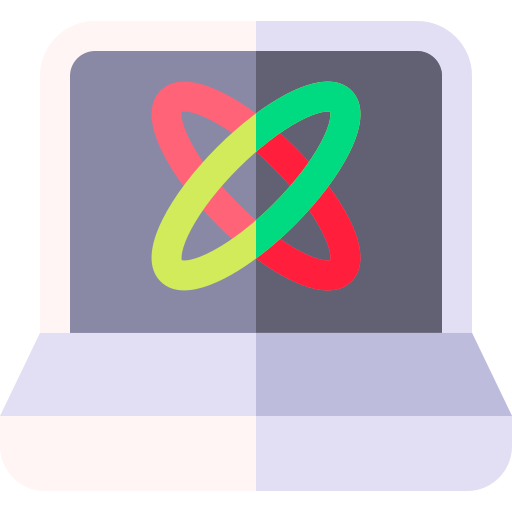
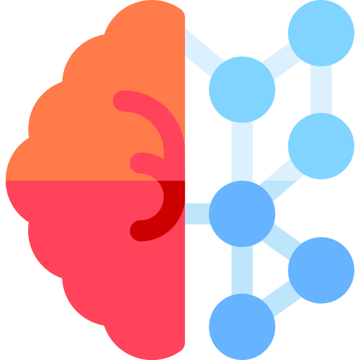
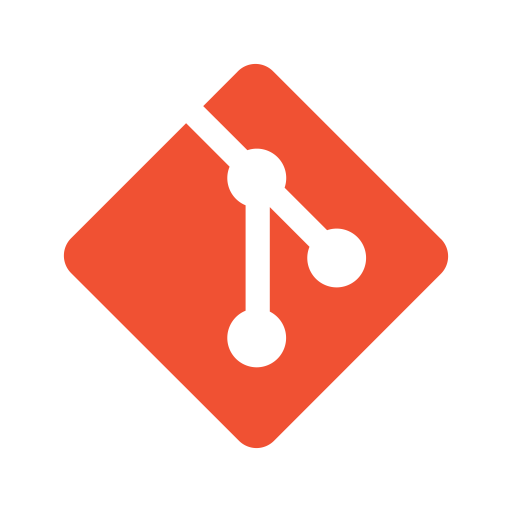
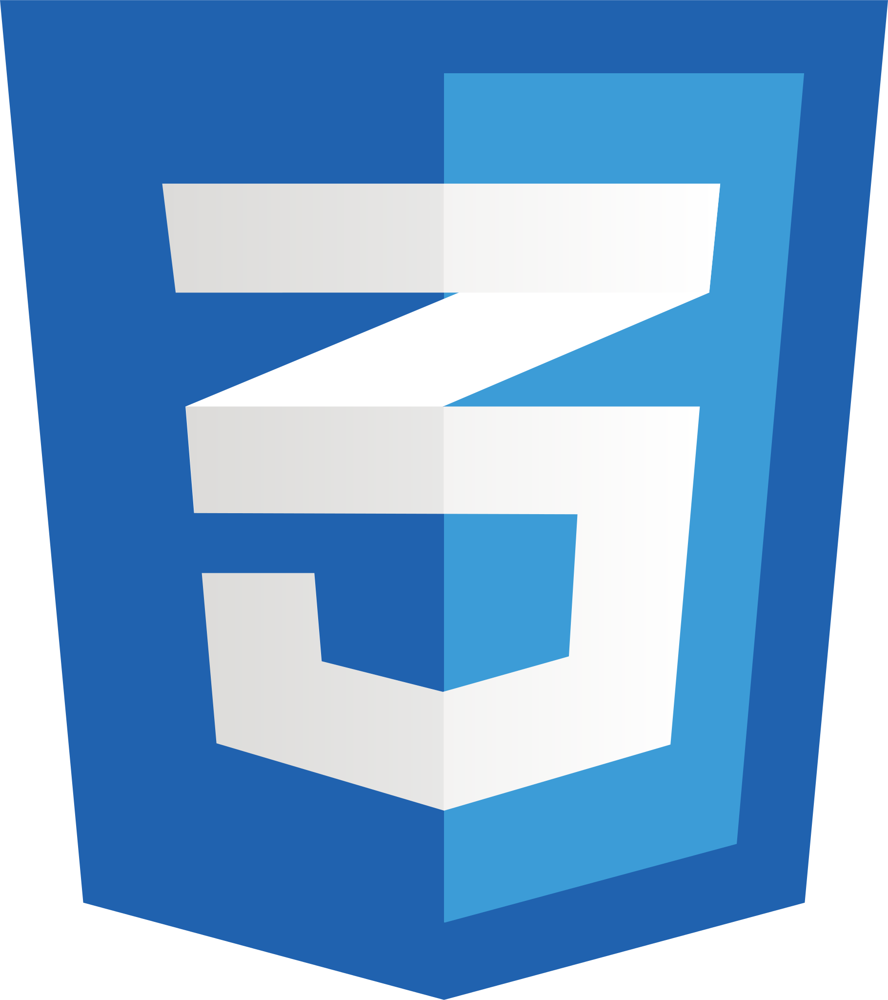
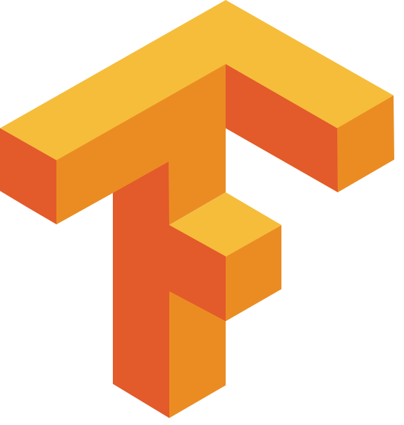
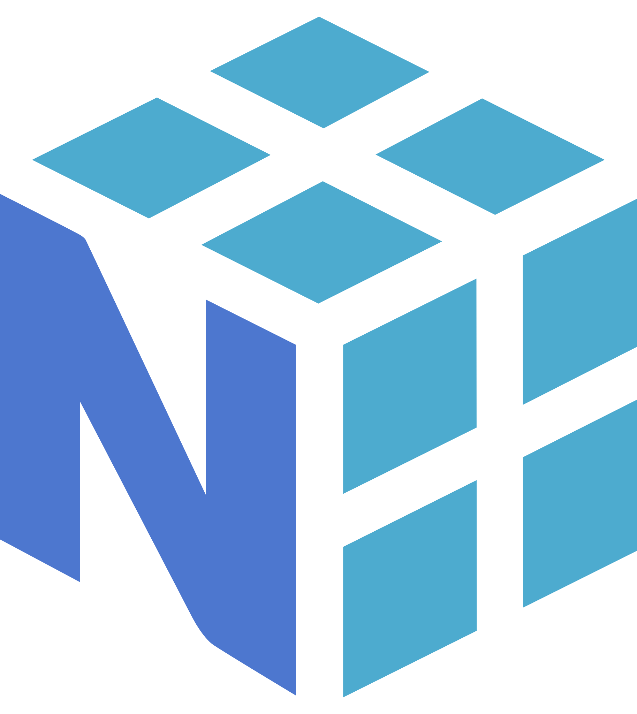
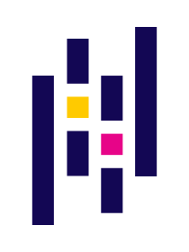

<h2 align="left">Heya, I'm Anushka</h2>
<!--Intro Section-->

&nbsp;&nbsp;&nbsp;&nbsp;&nbsp;&nbsp;&nbsp;&nbsp;Data and AI Engineer at Accellor Inc. 
&nbsp;&nbsp;&nbsp;&nbsp;&nbsp;&nbsp;&nbsp;&nbsp;B.Tech in CSE (AI & ML) from VIT Bhopal 
&nbsp;&nbsp;&nbsp;&nbsp;&nbsp;&nbsp;&nbsp;&nbsp;Specializing in Multi-Agent AI Systems, LLMs, RAG & ML on Azure 
  

<!--Skills Section-->
## Tech Stack

<h4>Languages & Tools</h4>

	&nbsp;
	&nbsp;
	&nbsp;
	&nbsp;
	&nbsp;
	&nbsp;

<h4>Agentic AI & LLMs</h4>

	Microsoft Agent Framework (MAF) &bull; LangChain &bull; LangGraph &bull; LangFlow &bull; OpenAI API &bull; Azure OpenAI &bull; Gemini API &bull; ReAct Agents &bull; HITL Workflows &bull; Prompt Engineering

<h4>Machine Learning</h4>

	&nbsp;
	&nbsp;
	&nbsp;
	&nbsp;
	&nbsp;
	&nbsp;

	XGBoost &bull; LightGBM &bull; Deep Learning &bull; Neural Networks &bull; Intent Classification

<h4>RAG & Search</h4>

	Retrieval-Augmented Generation (RAG) &bull; Azure AI Search &bull; Vector Embeddings &bull; Semantic Search &bull; Neo4j Knowledge Graphs &bull; Azure AI Document Intelligence

<h4>Cloud & Data</h4>

	Microsoft Azure &bull; Azure Function Apps &bull; Cosmos DB &bull; Azure Blob Storage &bull; PostgreSQL &bull; Microsoft Fabric &bull; FastAPI &bull; ReactJS &bull; REST APIs &bull; Great Expectations

 

## Experience

**Data and AI Engineer** @ Accellor Inc. *(July 2024 - Present)*

<h4>Multi-Agent AI & Automation</h4>

- Designed end-to-end procurement automation using self-hosted Microsoft Agent Framework (MAF) with 8+ specialized agents supporting handoff, concurrent, sequential, and HITL approval workflows
- Architected multi-agent automation platform using FastAPI and MAF with 15+ specialized agents, reducing manual content creation time by ~60%
- Built human-in-the-loop review pipelines with feedback-driven agent-reviewer loops cutting editing effort by 50-60%
- Implemented ReAct agents using LangGraph and Azure OpenAI, orchestrated by supervisor agents for dynamic query routing

<h4>Machine Learning & AI</h4>

- Developed ML inference services using XGBoost and LightGBM for UNSPSC category prediction and supplier scoring
- Built intent classification models routing procurement requests across 5 smart-form paths
- Engineered supplier ranking algorithms using MSME status, performance history, category coverage, and delivery quality signals
- Built Three-View Decision Support System with independent AI bid evaluation generating per-criterion ratings

<h4>RAG & Knowledge Systems</h4>

- Built RAG pipelines using Azure AI Search with semantic vector embeddings across 66 government entities, achieving groundedness score ≥0.85 and citation precision ≥0.90
- Implemented Neo4j knowledge graph with vector embeddings for semantic search and contextual reasoning
- Integrated Core42 Compass sovereign LLMs with UAE data residency via dedicated AI API Management layer

<h4>Data Engineering & Governance</h4>

- Implemented durable agent state management using Azure Cosmos DB with BU-scoped tenant isolation and 5-stage middleware pipeline for enterprise AI governance
- Led data migration across PMM Lakehouse, Microsoft Fabric, AS400, XStore, Salesforce OMS API, and Azure Blob Storage
- Designed Python-based data validation platform using Great Expectations framework for automated accuracy, completeness, and consistency checks

 

## Education

**Bachelor of Technology** in Computer Science - Artificial Intelligence and Machine Learning 
Vellore Institute of Technology, Bhopal | GPA: 8.2/10

 

## Certifications

- Databricks Certified Data Engineer Associate
- Machine Learning Specialization - Stanford University (Coursera)
- Microsoft Azure AI Fundamentals (AI-900)
- Google Cloud Big Data and Machine Learning Fundamentals

 

<!--Connect Section-->

<i>Let's connect and chat!</i> 

	&nbsp;&nbsp;&nbsp;&nbsp;&nbsp;&nbsp;&nbsp;&nbsp;&nbsp;&nbsp;&nbsp;&nbsp;&nbsp;&nbsp;&nbsp;&nbsp;&nbsp;&nbsp;
	

